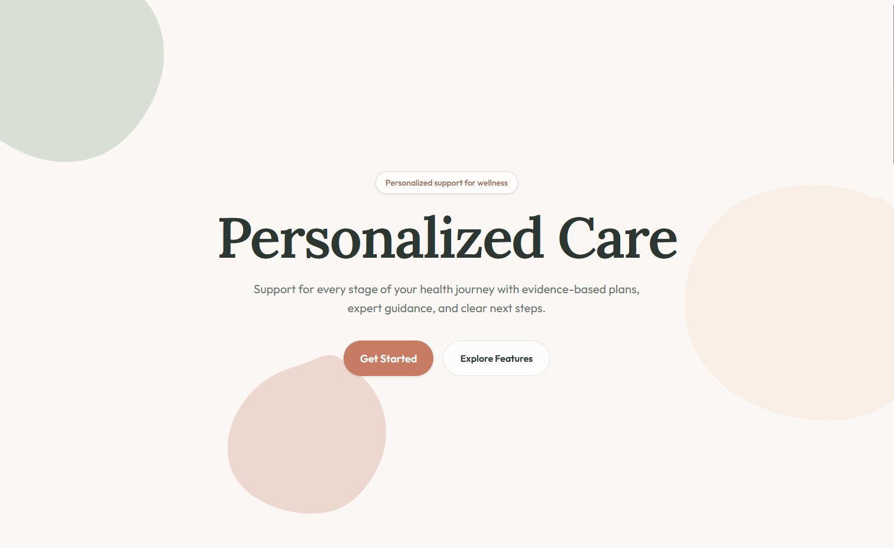

# BloomCare Demo (Figma → React with AI)



---

## 🚀 Overview

This project is a lightweight demo showcasing an AI-assisted **design-to-code workflow**, starting from a prompt-driven design and ending with a clean, component-based React application.

The goal was to explore how modern tools like Figma AI, Claude, and ChatGPT can accelerate frontend development while still maintaining clean architecture and reusable components.

---

## 🧭 Workflow

### 1. Figma AI (Make) – Prompt-Based Design
- Generated a healthcare landing page using a structured text prompt
- Defined layout sections:
  - Hero section
  - Feature cards
  - Booking section
  - Call-to-action footer
- Focused on clean layout and hierarchy for future code generation
- See **figma_prompt.txt** for prompt details

---

### 2. Initial Code Generation
- Figma AI generated a working React implementation
- Ran the project locally to validate layout and structure

---

### 3. AI-Assisted Refinement (ChatGPT)
- Refactored generated code into a clean component structure
- Reduced dependencies and removed unnecessary AI-generated complexity
- Improved readability and maintainability
---

### 4. Component Cleanup & Validation
- Broke UI into reusable components:
  - `HeroSection`
  - `FeatureCard`
  - `BookingSection`
  - `FooterCTA`
- Fixed styling issues (contrast, spacing, alignment)
- Re-tested locally to ensure correctness

---

### 5. Next Steps
- Integrate **Figma MCP (Model Context Protocol)** for structured design-to-code workflows
- Explore **Figma Code Connect** for mapping design components to production React components
- Compare prompt-based vs structured design-driven outputs

---

## 🧱 Tech Stack

- React
- Vite
- JavaScript (ES6+)
- CSS

---

## 🧠 Key Takeaways

- AI is powerful for rapid UI scaffolding, but **human refinement is essential**
- Clean component architecture significantly improves output quality
- Figma AI is great for ideation, but lacks structured design context
- MCP + Code Connect represent the future of **true design-to-code pipelines**

---

## 📦 Getting Started

```
npm install
npm start
```

## Build

```bash
npm run build
```

---

## 📌 Notes

This is a demo project intended to explore modern AI-assisted frontend workflows. It is not production-ready, but serves as a strong proof-of-concept and portfolio piece.

